# Skill Call Graph

Generated by `library-skill` on 2026-05-20.

Visual map of how skills in agent-loom call each other. Arrows show direction of invocation (`caller → callee`). Skills with no outgoing arrows are leaf nodes. 90 skills across meta, thinking, and project-specific categories (`domain` reserved, currently empty), plus the `setup-evaluator` agent.

```mermaid
flowchart LR
  subgraph Meta
    usc[universal-skill-creator]
    imp[improve-skills]
    val[validate-skills]
    res[research-skill]
    pru[prune-skill]
    com[compress-skill]
    spl[split-skill]
    dep[deprecate-skill]
    lib[library-skill]
    cls[cross-link-skills]
    pub[publish-skill]
    sdc[skill-deconflict]
    srt[skill-routing]
    lf[learn-from]
    lfp[learn-from-paper]
    lfr[learn-from-repo]
    lfa[learn-from-article]
    lfc[learn-from-chat]
    sec[secure-skill]
    sec-cs[secure-skill-content-sanitization]
    sec-ri[secure-skill-repo-ingestion]
    sec-rt[secure-skill-runtime]
  end

  subgraph Thinking
    bra[brainstorming]
    dt[deep-thinking]
    inv[inversion]
    adv[adversarial-hat]
    pre[pre-mortem]
    asm[assumption-mapping]
    soc[socratic]
    fp[first-principles]
    so[second-order]
    fer[fermi]
    ooda[ooda]
  end

  subgraph PS_Planning["PS: Product & Planning"]
    ps[product-soul]
    prd[prd-writing]
    p2p[problem-to-plan]
    ipl[implementation-plan]
    fs[feature-spec]
    pc[project-constitution]
    sdd[spec-driven-development]
    scc[spec-crosscheck]
  end

  subgraph PS_Engineering["PS: Engineering"]
    tdd[test-driven-development]
    crsp[code-review-crsp]
    daf[debug-and-fix]
    tda[technical-debt-audit]
    cbu[codebase-understanding]
    adl[architectural-decision-log]
    asa[agent-system-architecture]
  end

  subgraph PS_Setup["PS: Setup & Orchestration"]
    psu[project-setup]
    rps[retroactive-project-setup]
    po[project-orchestrator]
    pd[process-decomposer]
    sf[skill-finder]
    tf[tool-finder]
    gen[generate-changelog]
    app[apply-paper-to-project]
    rc[reality-check]
  end

  subgraph PS_AgentDesign["PS: Agent Design"]
    ab[agent-builder]
    se[setup-evaluation]
    cap[create-agent-prompt]
    al[agent-launcher]
  end

  subgraph PS_Memory["PS: Memory"]
    mem[memory]
    m-st[memory-startup]
    m-rc[memory-recall]
    m-cp[memory-capture]
    m-hf[memory-handoff]
    m-dc[memory-decision]
    m-pr[memory-promote]
    m-cm[memory-compact]
    m-au[memory-audit]
    m-fg[memory-forget]
  end

  subgraph PS_Eval["PS: Evaluation"]
    eo[eval-output]
    erd[eval-rubric-design]
    ej[eval-judge]
    ep[eval-pipeline]
  end

  subgraph PS_Experiment["PS: Experimentation"]
    exp[experimentation]
    ebk[experiment-backlog]
    esp[experiment-spec]
    erb[experiment-runbook]
    ero[experiment-readout]
  end

  subgraph PS_Frontend["PS: Frontend Design"]
    fd[frontend-design]
    da[design-archetype]
    dtc[design-tokens-craft]
    ic[icon-craft]
    dr[design-review]
  end

  subgraph PS_Venture["PS: Venture Exploration"]
    ve[venture-exploration]
    ig[idea-generation]
    bm[business-modeling]
    ie[idea-evaluation]
    cd[customer-discovery]
  end

  subgraph Agents
    seval["setup-evaluator (agent)"]
  end

  %% --- Meta skill lifecycle ---
  usc --> res
  usc --> spl
  usc --> com
  usc --> val
  usc --> sdc
  usc --> cls
  usc --> lib
  usc --> pub
  usc --> gen
  usc --> sec
  usc --> m-cp
  imp --> val
  imp --> dep
  imp --> pru
  imp --> res
  imp --> spl
  imp --> com
  imp --> sdc
  imp --> cls
  imp --> lib
  spl --> lib
  dep --> lib
  lib --> gen
  sf --> usc
  sf --> lib
  res --> sec

  %% --- Learn-from family ---
  lf --> lfp
  lf --> lfr
  lf --> lfa
  lf --> lfc
  lfp --> sec
  lfp --> usc
  lfp --> app
  lfp --> val
  lfr --> sec
  lfr --> usc
  lfr --> val
  lfa --> sec
  lfa --> usc
  lfa --> val
  lfc --> val
  lfc --> imp

  %% --- Security chain ---
  sec --> sec-cs
  sec --> sec-ri
  sec --> sec-rt

  %% --- Thinking frameworks ---
  dt --> inv
  dt --> pre
  dt --> asm
  dt --> soc
  dt --> adv
  dt --> fp
  dt --> so
  dt --> fer
  dt --> ooda
  bra --> inv
  prd --> inv
  ps --> inv

  %% --- Spec-driven development ---
  sdd --> pc
  sdd --> fs
  sdd --> ipl
  sdd --> scc
  sdd --> tdd
  p2p --> sdd

  %% --- Project setup & orchestration ---
  po --> pd
  po --> srt
  po --> psu
  po --> ab
  pd --> sf
  pd --> tf
  pd --> res
  psu --> pc
  psu --> m-st
  psu --> usc
  rps --> cbu
  rps --> ps
  rps --> adl
  rps --> psu
  rps --> m-cp
  app --> adl
  rc --> adv
  rc --> asm
  rc --> cbu
  rc --> ipl

  %% --- Agent design pipeline ---
  ab --> asa
  ab --> cap
  ab --> seval
  ab --> po
  seval --> se
  se --> al

  %% --- Memory suite ---
  mem --> m-st
  mem --> m-rc
  mem --> m-cp
  mem --> m-hf
  mem --> m-dc
  mem --> m-pr
  mem --> m-cm
  mem --> m-au
  mem --> m-fg
  mem --> sec

  %% --- LLM output evaluation ---
  eo --> erd
  eo --> ej
  eo --> ep

  %% --- Experimentation ---
  exp --> ebk
  exp --> esp
  exp --> erb
  exp --> ero
  exp --> asm
  exp --> bra
  exp --> inv
  exp --> fer
  exp --> eo
  exp --> prd
  exp --> adl
  exp --> rc
  ebk --> asm
  ebk --> fer
  esp --> inv
  esp --> fer
  erb --> p2p
  ero --> prd
  ero --> adl

  %% --- Frontend design ---
  fd --> da
  fd --> dtc
  fd --> ic
  fd --> dr

  %% --- Venture exploration ---
  ve --> ig
  ve --> bm
  ve --> ie
  ve --> cd
  ve --> ps
  ve --> bra
  ve --> prd
  ve --> exp
  ve --> rc
  ig --> fp
  ig --> soc
  bm --> fer
  ie --> fer
  ie --> asm
  ie --> pre
  ie --> adv
  cd --> sec
```

## Reading the Graph

- **Entry points** — skills users invoke directly: `universal-skill-creator`, `improve-skills`, `learn-from` (+ `learn-from-paper`/`-repo`/`-article`/`-chat`), `reality-check`, `project-orchestrator`, `project-setup`, `retroactive-project-setup`, `process-decomposer`, `agent-builder`, `deep-thinking`, `brainstorming`, `prd-writing`, `product-soul`, `venture-exploration`, `experimentation`, `eval-output`, `frontend-design`, `spec-driven-development`, `problem-to-plan`, `memory`
- **Orchestrators** — skills whose primary job is routing to a child set: `learn-from` → ingestion sub-skills; `deep-thinking` → thinking frameworks; `memory` → memory suite; `eval-output` → rubric/judge/pipeline; `experimentation` → backlog/spec/runbook/readout; `frontend-design` → archetype/tokens/icons/review; `venture-exploration` → idea/model/eval/discovery; `spec-driven-development` → constitution/spec/plan/cross-check/TDD; `project-orchestrator` → process & setup layer
- **Meta chain** — `improve-skills` runs the full cycle: validate → ingest `docs/learnings/chat-learnings.md` → deprecate → prune → research → rewrite → split/compress → cross-link → library-skill → generate-changelog → write terminal statuses back to chat-learnings
- **Targeted improvement loop** — `learn-from-chat` (in-session) escalates restructure-class edits to `improve-skills TARGET=<skill> SKIP_RESEARCH=true`; `improve-skills` also reads OPEN entries from `docs/learnings/chat-learnings.md` during periodic full passes — the two skills form one closed feedback loop
- **Library sync** — `library-skill` is invoked after every structural change (by `universal-skill-creator`, `split-skill`, `deprecate-skill`, `improve-skills`, `skill-finder`) and fans out to SKILL-INDEX, AGENTS.md, README, this graph, PRD, and architecture, then calls `generate-changelog`
- **Security gate** — `secure-skill` orchestrates three siblings (`content-sanitization`, `repo-ingestion`, `runtime`) and is called by the whole `learn-from` family, `research-skill`, `universal-skill-creator`, `memory`, and `customer-discovery` (before external-transcript synthesis)
- **Process & agent layer** — `process-decomposer` → `agent-builder` → `setup-evaluator` (agent) → `setup-evaluation` (skill) → on PASS `agent-launcher` → execution; `project-orchestrator` ties it together
- **Cross-suite reuse of thinking frameworks** — `reality-check`, `idea-evaluation`, `experiment-spec`, `experiment-backlog`, and `business-modeling` all reach back into `assumption-mapping` / `inversion` / `pre-mortem` / `fermi` / `adversarial-hat` rather than reimplementing them
- **Agents** — `setup-evaluator` is the only runtime agent (not a skill on disk); it exists to run `setup-evaluation` independently of `agent-builder` to avoid confirmation bias
- **Leaf nodes** (called but call nothing): `validate-skills`, `research-skill` only fans to `secure-skill`, `prune-skill`, `publish-skill`, `generate-changelog`, `tool-finder`, `create-agent-prompt`, `agent-launcher`, all `secure-skill-*` siblings, all `memory-*` leaves, `eval-rubric-design`/`eval-judge`/`eval-pipeline`, `design-*` leaves, and all thinking frameworks except `deep-thinking`
- **Domain skills** — none yet; the category is reserved for project-type-specific skills built on demand via `universal-skill-creator`
