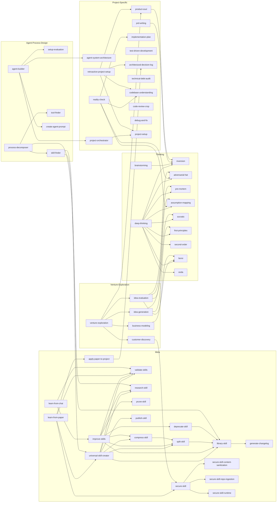

# Skill Call Graph

Generated by `library-skill` on 2026-05-13.

Visual map of how skills in agent-loom call each other. Arrows show direction of invocation (`caller → callee`). Skills with no outgoing arrows are leaf nodes.

## Reading the Graph

- **Entry points** — skills users invoke directly: `universal-skill-creator`, `improve-skills`, `learn-from-paper`, `reality-check`, `project-orchestrator`, `project-setup`, `retroactive-project-setup`, `process-decomposer`, `agent-builder`, `deep-thinking`, `brainstorming`, `prd-writing`, `product-soul`, `venture-exploration`
- **Meta chain** — `improve-skills` runs the full cycle: validate → ingest `docs/learnings/chat-learnings.md` → deprecate → prune → research → rewrite → split/compress → cross-link → library-skill → generate-changelog → write terminal statuses back to chat-learnings
- **Targeted improvement loop** — `learn-from-chat` (in-session) escalates restructure-class edits to `improve-skills TARGET=<skill> SKIP_RESEARCH=true`; `improve-skills` also reads OPEN entries from `docs/learnings/chat-learnings.md` during periodic full passes — the two skills form one closed feedback loop
- **Security gate** — `secure-skill` orchestrates three sibling skills (`content-sanitization`, `repo-ingestion`, `runtime`) and is called by `learn-from-paper` and internally by `research-skill`, `universal-skill-creator`, `improve-skills`
- **Process layer** — `process-decomposer` → `agent-builder` → `setup-evaluation` → `project-orchestrator` → execution
- **Leaf nodes** (called but call nothing): `validate-skills`, `research-skill`, `prune-skill`, `publish-skill`, `generate-changelog`, `tool-finder`, `create-agent-prompt`, `setup-evaluation`, and all thinking framework skills except `deep-thinking`
